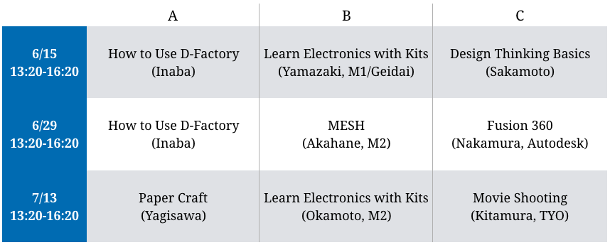

# Syllabus

[Engineering Design Project A B - TOKYO TECH OCW](http://www.ocw.titech.ac.jp/index.php?module=General&action=T0300&GakubuCD=2&GakkaCD=321502&KeiCD=15&course=2&KamokuCD=321502&KougiCD=201903604&Nendo=2019&vid=03&lang=EN)

# Staff

## Instructors

* Shigeki Saito, Prof.
* Hiraku Sakamoto, Associate Prof.
* Kazuaki Inaba, Associate Prof.
* Takumi Ohashi, Assistant Prof.
* Yuki Taoka, Assistant Prof.
* Masanori Kado, Specially appointed lecture
* Masaki Yagisawa, Tokyo University of the Arts
* Ryo Terui, Musashino Art University

See Also [Faculty Page](/faculty-team//)

## Teaching Assistants

* Yosuke Tajiri
* Yuval Kahlon
* Amane Muraoka
* Yosuke Akahane

## Lecturer for Special Topics

* Nakamura, Autodesk
* Kitamura, TYO
* Okamoto, M1
* Yamazaki, M1/Geidai

# Objective
Preparing for EDP-B/C.

1. Engineering: Create mid-fi tangble prorotypes with some budget.
2. Design: Get used to EDP-toolkit.
3. Project: Join a multidisciplinary team.

# Design Prompt
Design a new user experience through prototyping a new home electrical appliance.

# Artifacts
* Movie
* Poster
* Prototype
* Sheets of Toolkit
* Demo Booth

# Schedule

## [EDP-A-1] 6/15（Sat）10:00-17:35

* AM(10:00-12:15): Guidance, Team Building, LT
* PM1(13:20-16:20): Mini-Lecture (See below)
* PM2(16:35-17:35): Group Work

<iframe src="https://www.facebook.com/plugins/post.php?href=https%3A%2F%2Fwww.facebook.com%2Ftitech.cbec%2Fposts%2F978910185651195&width=500" width="500" height="909" style="border:none;overflow:hidden" scrolling="no" frameborder="0" allowTransparency="true" allow="encrypted-media"></iframe>

## [EDP-A-2] 6/29（Sat）10:00-17:35

* AM(10:00-12:15): Team Building, LT
* PM1(13:20-16:20): Mini-Lecture (See below)
* PM2(16:35-17:35): Group Work

<iframe src="https://www.facebook.com/plugins/post.php?href=https%3A%2F%2Fwww.facebook.com%2Ftitech.cbec%2Fposts%2F989133164628897&width=500" width="500" height="928" style="border:none;overflow:hidden" scrolling="no" frameborder="0" allowTransparency="true" allow="encrypted-media"></iframe>

## [EDP-A-3] 7/13（Sat）10:00-17:35

* AM(10:00-12:15): Progress Report
  * 5 min / team
  * Ideally, at least 3 ideas and 1 prototype.
* PM1(13:20-16:20): Mini-Lecture (See below)
* PM2(16:35-17:35): Group Work

## [EDP-A-4] 7/27（Sat）10:30-15:50

* AM(10:00-12:15): Group Work and Preparation
* PM(13:20-15:50): Demo (Poster and Prototype)

## Mini-Lecture Schedule

# References

- Slack: <https://edp-2019.slack.com>
- [EDP Toolkit](/toolkit)

<!-- # Final Report
 !-- 
 !-- 本レポートは【最終発表会】の終了後に提出してください！！
 !-- Please use this form AFTER YOUR FINAL PRESENTATION!!!
 !-- 
 !-- EDP-Aを終えて今「あなたが」「自らの体験に基づいて」考えるところを記述してください。（日本語回答の場合、各設問250文字の回答を想定。英語での回答も可（下記参照）。）
 !-- Please answer the following questions either in English or in Japanese, based on YOUR Actual Experience in this class. For each questions, please answer in One Paragraph (approx. 100 words).
 !-- 
 !-- 字数をカウントするため、まずWordなどに記述してから、コピー＆ペーストすることをお薦めします。
 !-- Before submission, please write drafts using MS Words or other software to count the length of your answer.
 !-- 
 !-- 〆切：　2019年8月9日（金）　24:00
 !-- Due on 2019/8/9, Fri., 24:00
 !-- 
 !-- 1) デザインプロセスをDTFよりもさらに実践的に回す中で、あなたが新たに得た「学び」でもっとも大きかったことを一つ挙げてください（具体的なデザインプロセスやツールを挙げること）。そして、あなたの班の最終ソリューションの中に、そのプロセスやツールがどのように活かされたかを説明して下さい（抽象的な描写は避け、あなた自身の体験を書くこと）。While you utilize the design process in this lecture (more practically than DTF class), what was the biggest lesson (takeaway from this lecture) for you? And how your lesson was used in the final solution of your group? (Please describe your own experience.)
 !-- 
 !-- 
 !-- 2) デザインプロセスやツールの中で、十分に理解できなかった、あるいは十分に実行／活用できなかったことで、もっとも大きかったことを一つ挙げてください。そして、もしそのことがうまく実行できていれば、あなたの班の最終ソリューションをどのように改善できていたと考えているか説明して下さい。Among the design process that you studied in this lecture, what was the biggest thing that you could not understand or could not implement well? And in what way it might improve your final solution had you properly implement the design process?
 !-- 
 !-- 3) あなたの班の中で、（あなた以外で）もっとも貢献の大きかったメンバーの名前を書いて下さい。Please write the name of a member in your group (besides you) who contributed to the group activities the most.
 !-- 
 !-- 4) あなたのグループの活動の中で、上記のメンバーの貢献がなぜもっとも大きいと考えたのか（なぜ今後の自分のロールモデルとなりうるのか）、その理由を説明して下さい。抽象的な描写は避け、具体的なエピソードに基づく記述をしてください。Please explain the reason why you think this member has contributed to the group activities the most (why he/she can be your role model). Please avoid abstract description; please write concrete episodes. -->
