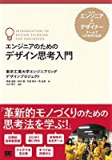

<h2>ブログ新着記事</h2>
<ul>

<li><a href="https://medium.com/titech-eng-and-design/-{{ i[1]['id'] }}">{{ i[1]['title'] }}</a></li>

</ul>

  
デザイン思考の歴史

  

  <ul>
<li><a href="https://medium.com/titech-eng-and-design/%E3%83%87%E3%82%B6%E3%82%A4%E3%83%B3%E6%80%9D%E8%80%83%E3%81%AE%E6%AD%B4%E5%8F%B2-%E7%90%86%E8%AB%96%E3%83%91%E3%83%BC%E3%83%881-e8ef02195fbe">理論パート1</a></li>
<li><a href="https://medium.com/titech-eng-and-design/%E3%83%87%E3%82%B6%E3%82%A4%E3%83%B3%E6%80%9D%E8%80%83%E3%81%AE%E6%AD%B4%E5%8F%B2-%E7%90%86%E8%AB%96%E3%83%91%E3%83%BC%E3%83%882-5b9cb1229064">理論パート2</a></li>
<li><a href="https://medium.com/titech-eng-and-design/%E3%83%87%E3%82%B6%E3%82%A4%E3%83%B3%E6%80%9D%E8%80%83%E3%81%AE%E6%AD%B4%E5%8F%B2-%E3%81%84%E3%81%8B%E3%81%AB%E3%81%97%E3%81%A6%E3%83%87%E3%82%B6%E3%82%A4%E3%83%B3%E6%80%9D%E8%80%83%E3%81%AB-%E3%81%AA%E3%81%A3%E3%81%9F-%E3%81%AE%E3%81%8B-9949a1b79c79">いかにしてデザイン思考に「なった」のか</a></li>
  </ul>
  

<h2>2018年度</h2>
<ul>
<li><a href="/2018-dtf-a/">デザイン思考基礎a</a></li>
<li><a href="/2018-dtf-b/">デザイン思考基礎b</a></li>
<li><a href="/2018-edp-a/">エンジニアリングデザインプロジェクトA</a></li>
<li><a href="/2018-edp-bc/">エンジニアリングデザインプロジェクトB/C</a></li>
</ul>

<h2>2017年度</h2>
<ul>
<li><a href="/2017-dtf-a/">デザイン思考基礎a</a></li>
<li><a href="/2017-dtf-b/">デザイン思考基礎b</a></li>
<li><a href="/2017-edp-a/">エンジニアリングデザインプロジェクトA</a></li>
<li><a href="/2017-edp-bc/">エンジニアリングデザインプロジェクトB/C</a></li>
</ul>

<h2>2016年度</h2>
<ul>
<li><a href="/2016-dtf/">デザイン思考基礎</a></li>
<li><a href="/2016-edp-a/">エンジニアリングデザインプロジェクトA</a></li>
<li><a href="/2016-edp-bc/">エンジニアリングデザインプロジェクトB/C</a></li>
</ul>

<h2>2015年度</h2>
<ul>
<li>デザイン思考基礎</li>
<li>エンジニアリングデザインプロジェクトA</li>
<li>エンジニアリングデザインプロジェクトB/C</li>
</ul>

  

<iframe frameborder="0" width="100%" height="600" src="https://peatix.com/event/407792/share/widget?z=1&t=1&a=1"></iframe>

  
EDPが書籍になりました :tada: 

  

  

  
:postbox: 企業のみなさまへ

  

東工大EDPにご関心のある企業様は、Peatixのページをフォローしていただければ、各種情報をお送りいたします。▶【<a href="https://titech-cbec.peatix.com/">東京工業大学CBECプログラム | Peatix</a>】
  

  
:office: これまでにご協力いただいた企業

  

<ul>
<li>【2017年度】NTTデータ、オロ、クックパッド、パナソニック、日本精工</li>
<li>【2016年度】凸版印刷、日本ゼオン、ツネイシカムテックス、モトローラソリューションズ、SAP、NTTデータ、井上電気、デンソー</li>
</ul>
  

  
:globe_with_meridians: 各種リンク

  

<ul>
<li><a href="http://www.eng.titech.ac.jp/~cbe/">東京工業大学 チーム志向越境型アントレプレナー育成プログラム（CBEC）</a></li>
<li><a href="http://www.esd.titech.ac.jp/">東京工業大学 - エンジニアリングデザインコース</a></li>
<li><a href="https://medium.com/titech-eng-and-design">東京工業大学エンジニアリングデザインプロジェクト – Medium</a></li>
</ul>
  

