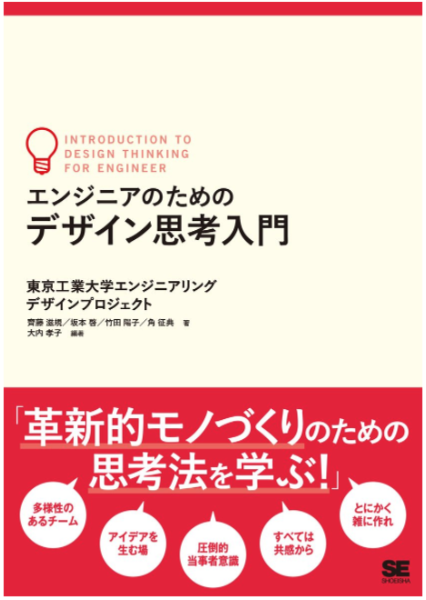

# EDPが書籍になりました！

[http://www.shoeisha.co.jp/book/detail/9784798153858](http://www.shoeisha.co.jp/book/detail/9784798153858)

# エンジニアリング、デザイン、デザイン思考を巡る80冊

ジュンク堂書店池袋本店6Fにて「[エンジニアリング、デザイン、デザイン思考を巡る80冊](https://medium.com/titech-eng-and-design/%E3%82%A8%E3%83%B3%E3%82%B8%E3%83%8B%E3%82%A2%E3%83%AA%E3%83%B3%E3%82%B0-%E3%83%87%E3%82%B6%E3%82%A4%E3%83%B3-%E3%83%87%E3%82%B6%E3%82%A4%E3%83%B3%E6%80%9D%E8%80%83%E3%82%92%E5%B7%A1%E3%82%8B80%E5%86%8A-76b53ee8ff90)」と題したフェアが開催されました。

# 過去に授業で取り上げた参考図書

[http://booklog.jp/users/edp2016](http://booklog.jp/users/edp2016)
