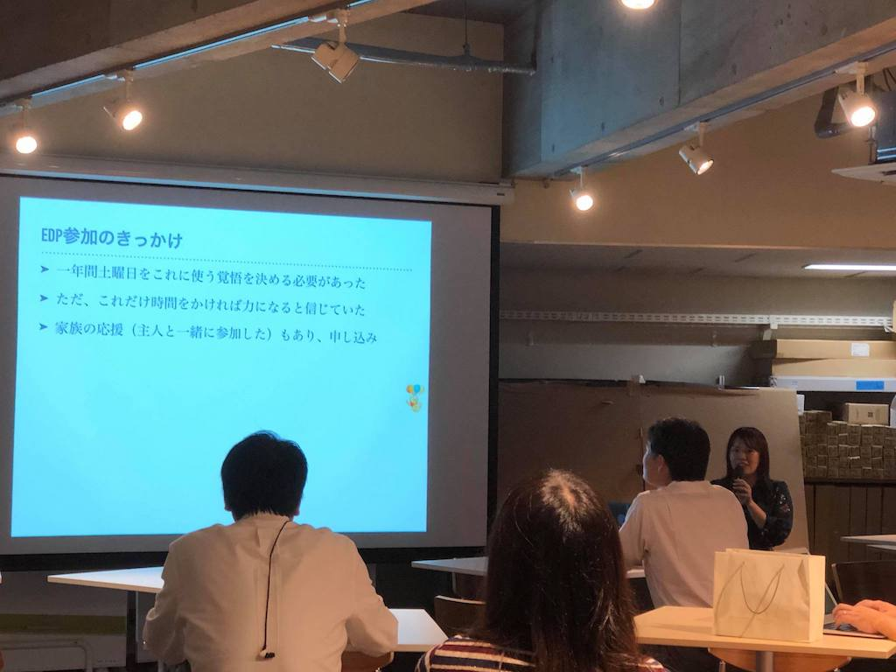

<ul>
<li>2018年9月26日 (水) 19:00 - 20:30</li>
<li>東京工業大学 大岡山キャンパス 石川台5号館3F デザイン工房</li>
<li>募集ページ：<a href="https://tokyo-tech-siged-01.peatix.com">https://tokyo-tech-siged-01.peatix.com</a></li>
<li>事前申し込み：35名</li>
<li>参加者：26名？ + 教員・職員5名</li>
<li>アンケートの回答数：22名</li>
</ul>

東京工業大学CBECプログラムでは、学生向けの講義に社会人の方々にも参加していただくことで、あらゆる境界を超えてチームとして世の中に新しい価値を生む力を育成し、その価値を実現する機会を持続的に提供することが目指しています。

本「エンジニアリングデザイン研究会」は、CBECプログラムの一部である「エンジニアリングデザインプロジェクト（EDP）」で得られた知見を共有・発展させ、企業のみなさまや社会に還元することを目的に発足いたしました。

## 1. 「学生ではなく社会人としてEDPに参画するということ」
EDPに参加したきっかけや参加前の期待・想像から、実際にプロジェクトに入ったときに得られたものや感想、そしてプロジェクトを終えたあと普段の業務にどんな良い影響があったかなどを事例を交えて赤裸々に話します。

### 発表者：日産自動車株式会社 松村翔子 (まつむらしょうこ)

> 2016年度EDP参加者。ターミナルとも人とも話したいサーバーサイドエンジニア。2012年に岐阜工業高等専門学校を卒業後、株式会社日立製作所に入社。設計開発者として海外市場向けプロダクトに従事し、アメリカ・イギリス・インドと協業しながら大企業でアジャイル開発を実施。その後、2016年に株式会社ぐるなびに転職後、サーバーサイドエンジニアとして「ぐるなび」サービスの検索の基幹部分に従事。現在は、今年の2月に入社した日産自動車株式会社でサーバーサイドエンジニアとしてconnected carとmobility serviceの開発に日々勤しんでいます。

### Q&A

#### Q. EDP-Aの学びであった「特に理由がなければ「あえて」を使わない」を詳しく教えて

* ユーザインタビューのときに、色々教えてもらえるが、そのインサイトを知ったとき、「この人は健康に気遣っているが「あえて」体に悪いものを出してみたら」とか言うと、「おっ」っとなるが、文脈をぶった切ることになるので、そういうのはやらないようにしようと思った。

#### Q. 「あえて」を狙うと思わぬ反応も得られておもしろいんじゃ?

* おもしろいとも思う。答えはないけど、ユーザに真摯に向かい合おうという思いがあった。純粋に「これ、欲しかった」と言われたかった。

#### Q. 「個人よりもチームの方が思いやりの幅が広い」共感できる広さは分かるが、深さについてはどうか?

* チームビルディングは良いこと。苦手な人もいるので、一定の所まで深堀ることが出来る。チームでインタビューをしたことによって、「相手を大事にしている」ということを示せた。個人で何となくやるよりは、一定のところまではいけたと思っている。

#### Q. 旦那さんといっしょに参加しての得られたものは?

* 課題の締切前は家庭内殺伐
* 違うチームだったので、気軽に呼び合ってユーザインタビューしあった
* 「旦那さんがシャイだけどいっしょにいると話す」というネタもEDP本に載った
* 夫は前より自分の意見を言うようになっていい変化

#### Q. 世の中のワークショップとEDPが大きく異なる所に「タンジブル」のしばりがあるが、それはどういう意味があったと思うか?

* 実際のモノがあるとぱっと見で、誰でも見て分かり易い
* たとえばスマホのアプリだと、ユーザのリテラシーを選んでしまう

## 2. 「イントラプレナーを目指して」
BtoB開発職のエンジニアが何を考えて仕事をしてきたか、CBECプログラムに参加してどう変わったかなどをお話ししようと思います

### 発表者：日本精工株式会社 稲田 圭克
> 2012年日本精工へ入社後、メカトロ技術に関係した要素技術および新商品の開発に従事。電動パワーステアリング、センサ製品の開発などに携わる。2017年より完全新規の先行開発を行う部署に勤務。専門は金属材料および電気回路。2017年度に東工大EDPに参加。

### Q&A

#### Q. 「価値ではなく商品を届ける」とはどういう意味か。価値を届けたいと思うのだが。

* 価値はユーザニーズを満たすもの、商品はビジネスになるものという意味で使った。

#### Q. どうやって社内に展開した?

[censored]

#### Q. デザイン思考を仕事でするときはチームでやっている?

* 市場をどこにするかで手こずっているので、まずは一人でやっている
  * 多様性のあるところからビッグバンが生まれるのが良い所
    * 一人でやるとプロダクトアウトになるので、そこは懸念している

#### Q. デザイン思考を企業に求められている期間と成果は?バイオデザインの企業で、1年やったら部署がなくなるという話を聞いた

[censored]

#### Q. デザイン思考をうまく伝えられない点に共感した。あえて研究開発との違いを言語化するとしたら?「同じじゃん?」と言われたらどう反論する?

[censored]

#### Q. 自分たちの会社の強みなどには捉われないでやりたいと言っていたが、株主と会社の理論からはGoを出せないと思う。既存の領域の中で売上を上げるしかない。あるいは、子会社を作るか外にでるしかない。コンサルとしてアドバイスするのは……（略）……とにかくインプットをたくさん増やすと良い。
  * ありがとうございます。

#### Q. 我々も社内で展開する時に戸惑う。完成品を作る人たちだとユーザがはっきりしていたり、明確な課題があったりするので、デザイン思考は入りやすいと思うが、御社のようなB2Bのベアリングなどではユーザが遠い。「どこの領域」などを考えるときに、いつも「デザイン思考を入り口に適しているか」を悩んでいる。他のメソッドを使うことも考えながら悩んでいるが、何か他のものもあるか?

* たしかに直接ソリューションがでてこないが、部品を使うお客様の抱えている課題を扱うのが手かなと思う。
  * 自分たちも同じ悩みがある。結局、部品に落ちない。情報を共有して欲しい。

（教員から補足）デザイン思考は万能ではない。「デザイン思考を学んだので使わないと」はデザイン思考ではない。未来洞察などを使いながら「新しい市場を作っていくんだ」であればフォローワーも増えるのではないか。漠然とデザイン思考を使うと難しい。シーズが先に決まっていて、同じような課題を抱えている企業に入ったこともある。そこではシナリオを異様にたくさん作って、その中で良さそうなのを探して、「一番御社に絡めるのはどれか」を選ぶという「バックキャスト」を使った。そうすれば、結構絡められる。

## 3. 「EDPツールキットのご紹介」
東京工業大学EDPでは、これまでのデザインプロセスを体系化して、2018年度から「EDPツールキット」を作成いたしました。本講演では、EDPツールキットの概要とその使い方をご説明します。

### 発表者：東京工業大学 環境・社会理工学院 特任講師 角 征典
> アジャイル開発やリーンスタートアップに関する書籍の翻訳を数多く担当し、それらの手法を企業に導入するコンサルティングに従事。主な訳書に『リーダブルコード』『Running Lean』『Team Geek』（オライリー・ジャパン）、『エクストリームプログラミング』『アジャイルレトロスペクティブズ』（オーム社）など。EDPでは講義内容の詳細設計を担当。共著書に『エンジニアのためのデザイン思考入門』（翔泳社）。

### Q&A

#### Q. これ使ったサンプルありますか?

* 1Qと2Qやったので、そのレポートを公開している。ただし、プロセスは同じなので結果が大きく変わるわけではない。ただ、プレゼンがうまくなった気がする。今まではフリーフォーマットだったので、聞く方が辛かった。

#### Q. 内省シートはなんで評判悪い?

* デザイン思考で頭からやっていくと少しずつずれていく。それを内省シートで戻すようにしている。つまり最後に「自分たちは何でこれを作ってるんだ?」という厳しい質問に答えないといけない。それが難しいんだと思う。

#### Q. 評判悪いのがいいサインかも。学生の話を聞いていると、「150kmの球をホームラン打て」と言われているように聞こえる。教員側は「振ればいいじゃん」なんだけど。シートが悪いというよりも、やっていることが難しい?

* そうだと思う。「君たちは何で作ってるの?」と聞かれても「授業なんで……」と答えるしかない。

#### Q. 奥出直人先生の本に「最初にフィロソフィーを書け」とあった。内省シートは、それをプロセスを一巡した後に書かせているものなのかなと思った。

* そういう感じかもしれない。

#### Q. こういうツールはいっぱいあると思うが、このツールに当てはめようと思ったときに目的と手段がすり変わることがあると思うが、うまい付き合い方はある?

* 難しい。一応、デザイン思考を初めて学んでいる人用に作った。2QではアレンジOK、後期では無視して良い、と言っている。ただ、実際に使ってもらいながら選んだので、世の中にいっぱいあるものよりは良いと思っている。

## 4. 質疑応答・議論
当日の様子を見ながら、質疑または会場での議論を実施します。

## アンケートのお願い
今後の運営のために、研究会終了後にご意見をお聞かせください。

## 会場へのアクセス
* [東京工業大学 大岡山キャンパス 石川台5号館3F デザイン工房](/access/)
* 1Fの玄関はロックされていますので、自動ドア横の電話で呼び出してください。

## 参加者の声（抜粋）

### 得られたこと

* 金言をいただけた。顧客の真の声にもっと近づきたくなった。「攻めるエンジニア」は心に響いた。／キヤノン（株） 小川茂夫
* みんな同じことで苦労しているな、これからも情報交換したいな、と思いました。／日本ゼオン（株） 周宏晃
* 具体的な悩みの部分（デザイン思考の社内適用）に共感できた。また、様々な方からの意見が参考になった。／株式会社ティー・ワイ・オー 川添太郎
* 良かった。B2B2Xの悩みに共感した。／NTTコムウェア 渡辺
* 社会人としてEDPに参加した経験が聞けてよかった。／オートデスク（株） 中村翼
* 経験談が聞けておもしろかったです。／株式会社MYNT 弓削田公司
* 悩みを共有できる人とつながれそうで期待。未来洞察などデザイン思考以外のツールへの知見も広げたい。／Panasonic 相田亮
* 特に稲田さんの発表とそれに対するFBと議論がよかったです。もっと深く詳しく議論したかった（聞きたかった）。／NTTデータ 堀越永幸

### 今後に期待すること
* 圧倒的当事者意識を発揮できそうなイベント。勉強会では受け身になりがち。
* 豊富な実績と様々な人が集まる多様性。参加しやすい時間と頻度。
* 新たなツールと適用事例の共有がいただけることと、デザイン思考他の活用を試みている人々の意見交換の場が提供されることに期待します。
* デザイン思考および関連する手法、考え方を学べることと、議論できること。
* 入り乱れた議論の場。EDPのチーム活動に近い感じがいいです。
* 実企業の課題をテーマに取り組める点。日本語によるデザイン思考の実践。
* 自分の悩みに関して参加者が議論してくれるととてもうれしい気がする。
* ここに行くだけで会社の成功が約束される、そんな魔法のような言葉。
* 実践のプロジェクトを行なう。
* ネットワーク、社外プロジェクトのプログラム化
* 新しい知見、ネットワーキング
* 会社内で実践されている方のさらなる知見の共有
* 講師の質、参加者のレベルの高さ、最先端の情報やノウハウの展開
* リアルな現場の視点・課題も含めた議論があるか
* 参加者の業種・業態にバラつきがあること（IT関連だとたくさんある）
* アカデミックな見解やFBを聞けること

## 謝辞

Q&A部分は、NTTコムウェア渡辺昌寛さんからご提供いただいたメモを編集しました。

## 参加者のブログ

* [EDP研究会に参加してエンジニアリングデザインについて少し学んだという話](http://wordpress.ideacompo.com/?p=12315)

## 総括

今回は初回ということもあり、どのような参加者がいらっしゃるのか、どのような期待を持っていらっしゃるのかについてあまり把握できておらず、「自分たちの発表したいことを話す」というスタンスで臨みましたが、みなさん熱心に発表に耳を傾け、その後の議論にも積極的に参加されていたように思います。特に「イノベーション文化を組織にどのように広めるか」は、多くの参加者に共通したお悩みのようでした。次回以降は、そうした側面に重点的にも触れていきたいと考えています。（角）
