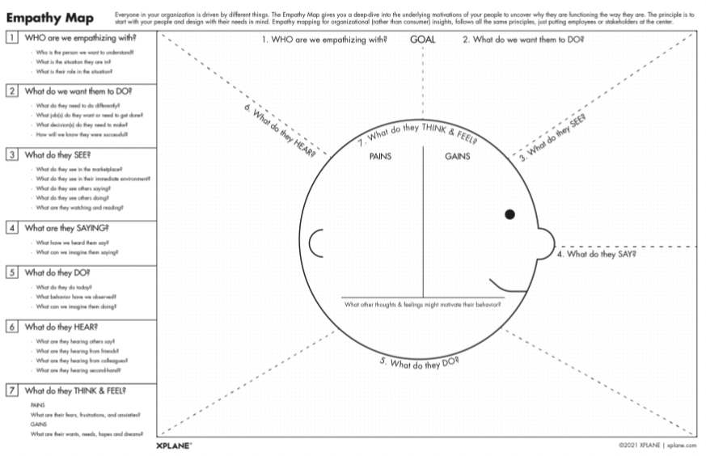

## 1. WHO are we empathizing with?

私たちは「誰に」共感しているのか？

* Who is the person we want to understand?
  * 私たちが理解したいと思っている人は誰か？
* What is the situation they are in?
  * 彼らが置かれている状況は？
* What is their role in the situation?
  * その状況における彼らの役割は？

## 2. What do we want them to DO?

彼らに何を「してもらいたい」のか？

* What do they need to do differently?
  * 彼らは何を違った方法で行う必要があるのか？
* What job(s) do they want or need to get done?
  * 彼らはどのようなジョブをしたいのか？/しなければならないのか？
* What decision(s) do they need to make?
  * 彼らはどのような決断をしなければならないのか？
* How will we know they were successful?
  * 彼らが成功したことをどうやって知ることができるのか？

## 3. What do they SEE?

彼らは何を「見て」いるのか？

* What do they see in the marketplace?
  * 彼らは市場で何を見ているのか？
* What do they see in their immediate environment?
  * 彼らは身の回りの環境で何を見ているのか？
* What do they see others saying?
  * 彼らは他人が何を言っているのを見ているのか？
* What do they see others doing?
  * 彼らは他人が何をしているのを見ているのか？
* What are they watching and reading?
  * 彼らは何を観ているのか？何を読んでいるのか？

## 4. What are they SAYING?

彼らは何を「言って」いるのか？

* What have we heard them say?
  * 彼らは何と言っていたか？
* What can we imagine them saying?
  * 彼らが何を言っているかを想像できるか？

## 5. What do they DO?

彼らは何を「している」のか？

* What do they do today?
  * 彼らは現在何をしているのか？
* What behavior have we observed?
  * 彼らのどのような行動を観察できたか？
* What can we imagine them doing?
  * 彼らが何をしているかを想像できるか？

## 6. What do they HEAR?

彼らは何を「聞いて」いるのか？

* What are they hearing others say?
  * 彼らは他人が何を言っているのを聞いているのか？
* What are they hearing from friends?
  * 彼らは友人から何を聞いているのか？
* What are they hearing from colleagues?
  * 彼らは同僚から何を聞いているのか？
* What are they hearing second-hand?
  * 彼らは人づてに何を聞いているのか？

## 7. What do they THINK & FEEL?

彼らは何を「考え」ているのか？何を「感じ」ているのか？

* PAINS（苦痛）
  * What are their fears, frustrations, and anxieties?
  * 彼らの恐怖、フラストレーション、不安は何か？
* GAINS（利得）
  * What are their wants, needs, hopes and dreams?
  * 彼らの欲求、ニーズ、希望、夢は何か？

## References

* <https://xplane.com/worksheets/empathy-map-worksheet/>
* <https://xplane.com/the-empathy-map-a-human-centered-tool-for-understanding-how-your-audience-thinks/>
* Old Versions:
  * <https://medium.com/the-xplane-collection/updated-empathy-map-canvas-46df22df3c8a>
  * <https://gamestorming.com/wp-content/uploads/2017/07/Empathy-Map-Canvas-006.pdf>
