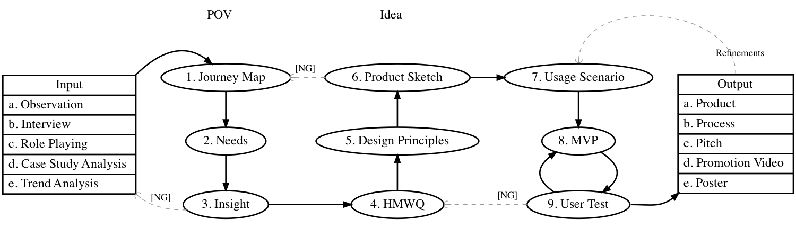

## Input

- a. Interview: [User Research Questions](user-research-questions.pdf) / [ユーザーリサーチに使える質問](user-research-questions_ja.pdf)
- b. Observation: [AEIOU Summary](aeiou.pdf)
- c. Role Playing: JUST DO IT
- d. Case Study Analysis: [Competitive Positioning Map](competitive-positioning-map.pdf)
- e. Trend Analysis: [9-window tool](9-window-tool.pdf)

## 1. Journey Map

- [User Journey Map](user-journey-map.pdf)

## 2. Needs

- [User Needs](user-needs.pdf) / [ユーザーニーズ](user-needs_ja.pdf)

## 3. Insight + 4. HMWQ

- [POV+HMWQ](pov-hmwq.pdf) / [POVとHMWQ](pov-hmwq_ja.pdf)
- [HMWQ samples](hmwq_samples.pdf)

## 5. Design Principles

- [Design Principles](design-principles.pdf)

## 6. Product Sketch

- [Product Sketch](product-sketch.pdf) / [プロダクトスケッチ](product-sketch_ja.pdf)

## 7. Usage Scenario

- [Storyboard](storyboard.pdf) / [ストーリーボード](storyboard_ja.pdf)
- [Casts-Props-Scene](cps.pdf) / [キャスト・小道具・シーン](cps_ja.pdf)

## 8. MVP

- [MVP Experimental Plan](mvp-plan.pdf)

## 9. User Test

- [User Test Questions](user-test-questions.pdf) / [ユーザーテストに使える最低限の質問](user-test-questions_ja.pdf)

## Output

- a. Product: JUST MAKE IT
- b. Process: TBD
- c. Pitch: [Pitch Template](/resources/pitch-template/)
- d. Plot: SHOOT A MOVIE based on the Storyboard and Casts-Props-Scene
- e. Poster: JUST MAKE IT

## Archive - Previous Toolkit

- [Toolkit V1](/toolkit_v1/)
