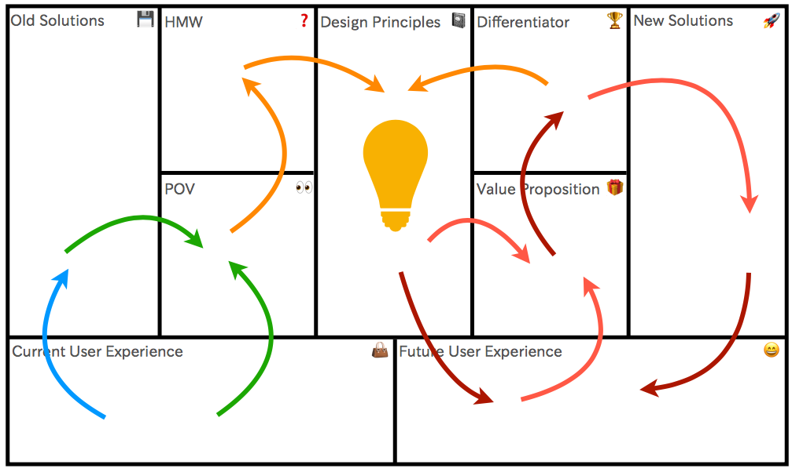
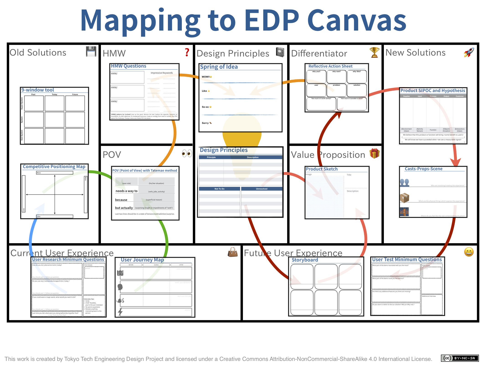

# Tools

<!-- 2. Customer Forces Canvas
 !-- 3. Tatemaed POV Sheet
 !-- 4. HMW Variations
 !-- 5. SIPOC
 !-- 6. Story Pines Template
 !-- 7. User Test Script -->

## Overview

- [EDP Canvas](edp-canvas.pdf)

## Empathize

- [User Journey Map](user-journey-map.pdf)
- [User Research Questions](user-research-questions.pdf) / [ユーザーリサーチに使える質問](user-research-questions_ja.pdf)

### Old Solutions
- [Competitive Positioning Map](competitive-positioning-map.pdf)
- [9-window tool](9-window-tool.pdf)

## Define

- [POV with Tatemae method](pov-tatemae_v2.pdf) / [POVとタテマエメソッド](pov-tatemae_ja_v2.pdf)
- [POV with Extreme Users](pov-extreme-users.pdf) / [POVとエクストリームユーザー](pov-extreme-users_ja.pdf)

## Ideate
- [HMWQ Sheet](hmwq.pdf) / [HMWQシート](hmwq_ja.pdf)
- [HMWQ samples](hmwq_samples.pdf)
- Spring of Idea / アイデアの泉
- [Design Principles](design-principles.pdf) / [デザイン原則](design-principles_ja.pdf)

## Prototype
- [Product Sketch Sheet](product-sketch.pdf) / [プロダクトスケッチ](product-sketch_ja.pdf)
- [Storyboard](storyboard.pdf)

### New Solutions
- [Product SIPOC](sipoc.pdf)
- [Casts-Props-Scene](casts-props-scene.pdf) / [キャスト・道具・シーン](casts-props-scene_ja.pdf)

## Test
- [Reflective Action Sheet](reflective-action-sheet.pdf)
- [User Test Questions](user-test-questions.pdf) / [ユーザーテストに使える最低限の質問](user-test-questions_ja.pdf)

## Mapping to EDP Canvas

# DTF worksheet

- [Today's World](todays-world.pdf) / [今日の世界](todays-world_ja.pdf)
- [Morning ritual](morning-ritual.pdf) / [朝の儀式](morning-ritual_ja.pdf)
- [Brainwriting](brainwriting.pdf)
